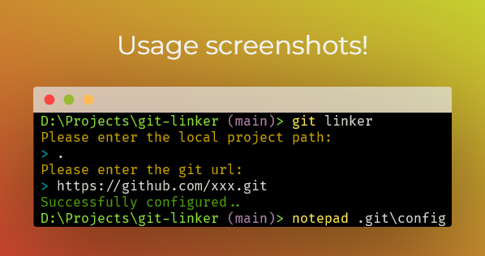

<h1 align="center">git-linker</h1>

<p align="center">git-linker — A tool to simplify Git url configuration, multi-platform Git path configuration can be completed through simple input.</p>



## How to use?

### 1. Install package

```bash
pnpm install git-linker -g

npm install -g git-linker
```

### 2. Terminal input git-linker

```bash
MZG@DESKTOP-KKAB511 MINGW64 /d/Projects/git-linker (master)
$ git-linker
Please enter the local project path (default . for current path):
> D:\Projects\PersonalProjects\xxxx
Do you want to add the URLs before or after existing ones?
> before
> after
Please enter the git URLs (separated by commas):
> https://github.com/xxx.git, https://gitee.com/xxxx.git
```

### The result as follows:

- **succcess:** Successfully added URL: `https://github.com/xxx.git`
- **fail:** To see error message
- **already exists:** The URL `https://gitee.com/xxxx.git` already exists in the config file.

### 3. If the configuration is successful, you can open the current project's .git/config to see that the URLs have been added.

```bash
# Run the following command under the current project
notepad .git/config
```

### The result as follows:

```bash
[remote "origin"]
	url = https://github.com/xxx.git # Newly added git url
	url = https://gitee.com/xxxx.git # Before git url
	fetch = +refs/heads/*:refs/remotes/origin/*
```
