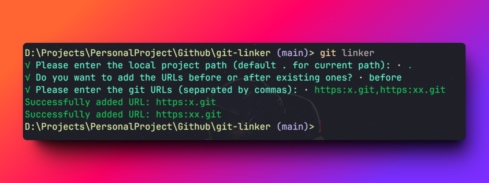

# [git-linker](https://github.com/yaolifeng0629/git-linker)

**[git-linker](https://github.com/yaolifeng0629/git-linker)** —— A tool to simplify Git url configuration, multi-platform Git path configuration can be completed through simple input.



# How to use?

1. Install package

```bash
pnpm install git-linker -g

npm install -g git-linker
```

2. Terminal input git-linker：

```bash

MZG@DESKTOP-KKAB511 MINGW64 /d/Projects/git-linker (master)
$ git-linker
Please enter the local project path:
> D:\Projects\PersonalProjects\xxxx
Please enter the new URL:
> https or ssh url

# The result as follows:
  # succcess: Successfully configured.
  # fail: To see error message
  # already exists: The new URL already exists in the config file.
```

3.  If the configuration is successful, you can open the current project's .git/config to see that there are already added urls.

```bash
# Run the following command under the current project
notepad .git/config
```

The result as follows:

```bash
[remote "origin"]
	url = https://github.com/xxx.git # Newly added git url
	url = https://gitee.com/xxxx.git # Before git url
	fetch = +refs/heads/*:refs/remotes/origin/*
```
